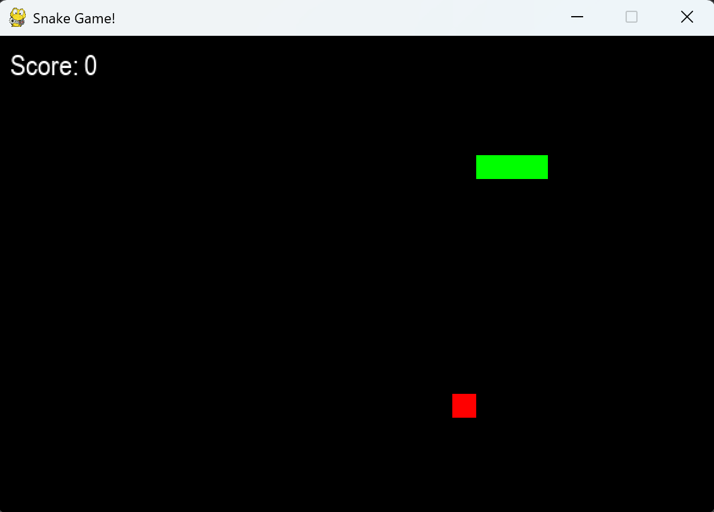
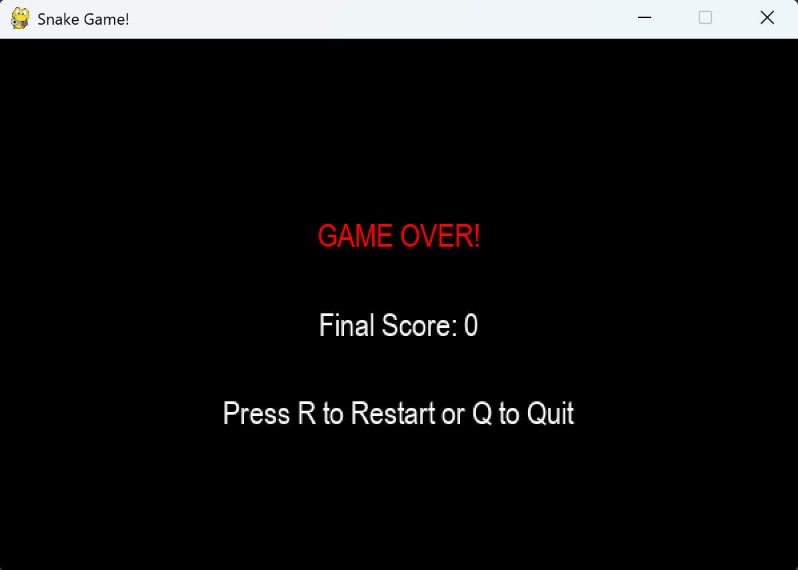

# 🐍 Snake Game
Welcome to the Snake Game! This is a fun and classic game coded in Python using the Pygame library. 

---

# 🎮 How to Play
1. Use the arrow keys (**↑, ↓, ←, →**) to control the snake.
2. Eat the red food blocks 🍎 to grow your snake and earn points.
3. Avoid crashing into the walls or your own tail!
4. The game speeds up as your snake grows. Good luck keeping up!

---

# 🚀 Features

- Dynamic Gameplay: The snake gets faster as it grows.
- Score Tracking: Your score is displayed in real-time.
- Game Over Screen:
  - Shows your final score.
  - Gives you the option to restart or quit.
- Sound Effects: Fun audio feedback for eating food and crashing.
- Personal Touch: Clean and creative code with a student’s flair! 

---

# 🛠️ Installation

To run the Snake Game on your computer, follow these steps:

1. Clone the repository:
   git clone https://github.com/Velazquez-karellen/Snake_Python_Project.git
   
2. Install Pycharm:
   - Make sure you have latest Pycharm installed.
3. Install Pygame:
   - Open a terminal and type:
     pip install pygame
     
4. **Run the game**:
   - Navigate to the project folder and execute the following command:
     python main.py

---

# 🎵 Sound Effects

- Eat Sound: Plays when the snake eats food.
- Game Over Sound: Plays when the game ends.
- Place your sound files in the Music/ folder and ensure they are named eat.mp3 and game_over.mp3.

---

# 💻 Screenshots

# Gameplay


# Game Over Screen


---

# ❤️ About Me

Hi! I’m **Karellen A. Velazquez Rivera**, a 19-year-old **Software Engineering student**. 
I love coding, creating cool projects, and bringing ideas to life through programming. 
This project is part of my learning journey, and I hope you enjoy playing it as much as I enjoyed building it!

---

# 📜 License

This project is licensed under the [MIT License](LICENSE). Feel free to use it, modify it, and share it!
```
You can now save this as `README.md` in your project folder and push it to your GitHub repository. Let me know if you need anything else! 😊 LinkedIn: www.linkedin.com/in/karellen-velazquez